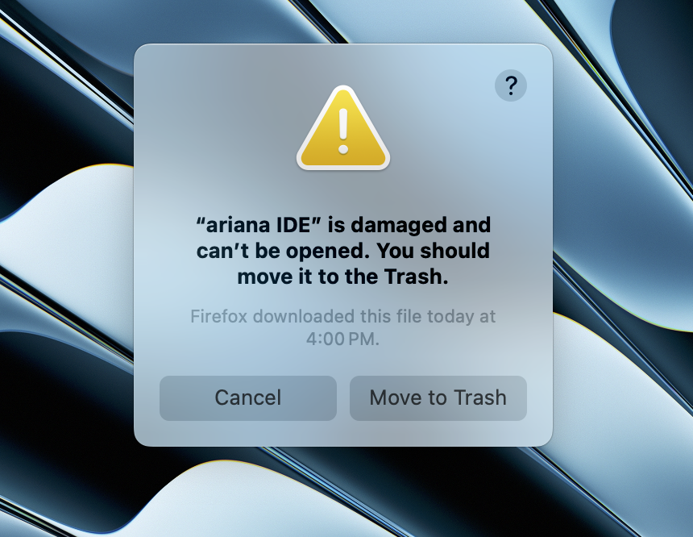
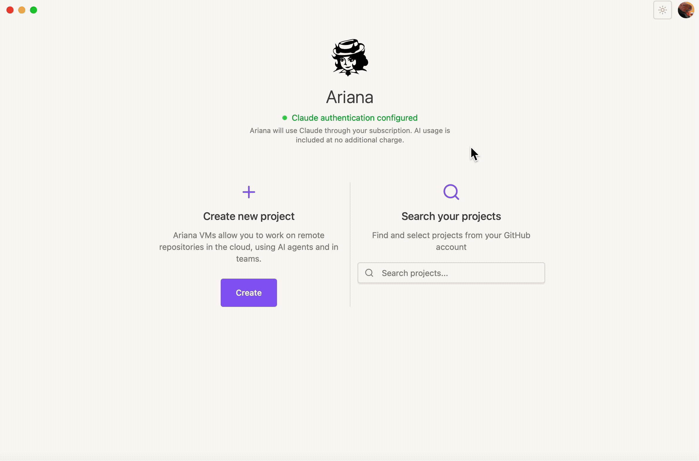

# Ariana IDE

<div align="center">
  
  <h2>User Guide Early Adopter Version</h2>
</div>

People responsible for this banger and who you can contact in case of problems or bugs:

Anicet - @anicetngrt | telegram

Kirill - @luaroncrew | telegram

## Table of Contents

1. [Using Agents](#using-agents)
2. [Installation](#installation)
3. [Authentication & Claude Configuration](#authentication--claude-configuration)
4. [Updating the App](#updating-the-app)

---

## Using Agents 🤖

To start using agents, please choose a project, open it, then click + to create a new agent

<div align="center">
  
</div>

Once the agent is initialized, you can ask it questions, give orders, and use it like you would usually use Claude Code

When an agent decides to add something to your codebase, you will be able to see these changes as incoming commits on the agent's personal branch inside your repository:

<div align="center">
  
</div>

*Enjoy Vibecoding! ✨*

## Installation 📦

In the early adopter Telegram group, you will find the app distribution files for macOS, Windows, and Linux.

#### macOS Specific

When you try to run the app, you may have this error appear:
<div align="center">
  
</div>

Don't worry, just run 🔧 

```sh
sudo xattr -rd com.apple.quarantine "/Applications/ariana IDE.app"

# you will be prompted for your device password
```


This will remove Apple's security restriction on the app from the unknown (soon very popular) distributor

---

## Authentication & Claude Configuration 🔐

### Setting Up Claude API

#### Windows

On Windows, there's a file `~/.claude/.credentials.json` which contains the necessary data for us to run your Claude subscription on cloud machines. The token there is refreshed automatically whenever you use Claude from your device. Ariana is capable of accessing this data. So, great news - you have nothing to do. 🎉

#### MacOS

macOS includes more security features, so the credentials file does not exist. Instead, on macOS you have a keychain store, which holds your credentials in an encrypted way. Ariana has not learned how to get them automatically, so you will have to go through manual Claude credentials setup


#### Manual Setup
For macOS users, you need to navigate to the Keychain Access application and search for "claude". In there you will find a field, normally accessible to read after password input. When done, copy the object you find there and paste it into the Ariana application

<div align="center">
  
</div>


#### ⚠️ Warning!

The macOS OAuth tokens have a very short lifespan and are not refreshed by Ariana. If you encounter a 401 error when using the agent, please repeat the manual setup.

#### Awareness 🔒
We do not store your Claude credentials in any database. The only purpose of having them is to allow you to use your Claude subscription on our VMs, and unfortunately, this is the most secure existing way to do this as of August 2024. Your credentials are stored only on your machine and then transferred to the VM directly by Ariana acting as a proxy.


### Authentication 🔑

GitHub authentication flow. Be sure to give access to repositories you want to use. The "GitHub Permissions" tab in the user menu allows you to change the permissions you grant to Ariana. 


---


## Updating the App 🔄

The app supports automatic updates. Just go to the updates tab and check whether there's an update available. If there is one, just click on the update button and you will get the latest version with no friction.

<div align="center">
  
</div>


---

*Welcome to the future of AI-powered development. Happy coding! 🚀*
